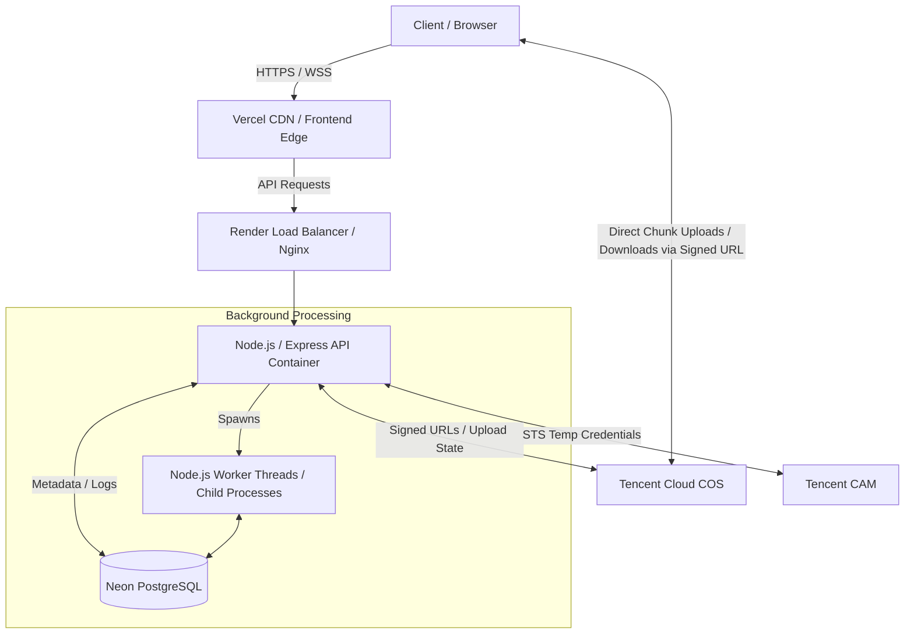

# System Architecture

## 1. High-Level Architecture Overview

The CeguyyyDrive platform follows a decoupled, service-oriented architecture using standard REST APIs and WebSockets.

## 2. Core Components

### 2.1 Frontend (React SPA)
- Deployed on Vercel.
- Communicates exclusively with the Node.js API for metadata, authentication, and pre-signed URL generation.
- Handles direct-to-cloud uploads to Tencent COS using pre-signed URLs to offload bandwidth from the Node.js server.

### 2.2 Backend (Node.js/Express)
- Deployed as Docker containers on Render.
- Serves as the central metadata controller.
- **Responsibilities**:
  - Authentication and Authorization.
  - Generating Pre-signed URLs for COS.
  - Tracking file metadata (virtual folders, versions) in PostgreSQL.
  - Audit logging.
  - WebSocket server for upload progress and real-time notifications.

### 2.3 Database (Neon PostgreSQL)
- Stores all logical relationships (Virtual Folders).
- Holds activity logs, sharing rules, file versions, and upload session states.
- Ensures ACID compliance for metadata transactions.

### 2.4 Cloud Storage (Tencent COS)
- Physically stores the binary data.
- Handles the multipart upload assembly.

### 2.5 Background Tasks
- Since Redis/BullMQ are forbidden, the Node.js application will spawn Worker Threads for heavy tasks (like zipping multiple files).
- The `upload_sessions` table acts as the state manager for long-running uploads or processing tasks.
