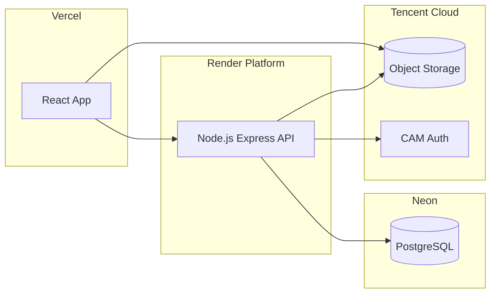

# Infrastructure

## 1. Network & Environment Diagram

## 2. Infrastructure Components
- **Domain & DNS**: Custom domain mapping via Vercel for Frontend.
- **Frontend CDN**: Vercel handles global distribution and SSL.
- **Backend Compute**: Render Web Service (Docker deployment). Auto-restarts on failure.
- **Database**: Neon Serverless PostgreSQL. Scales down to zero when idle (in dev) or maintains provisioned compute in production.
- **Storage**: Tencent Cloud COS Bucket. Configure CORS policies to allow direct uploads from the Vercel domain.

## 3. Environment Variables Strategy
### Frontend (`.env.production`)
- `VITE_API_URL`: Backend API URL.
- `VITE_COS_REGION`: Region of the COS bucket.
- `VITE_COS_BUCKET`: Name of the bucket.

### Backend (`.env`)
- `PORT`: 8080 (Render standard).
- `DATABASE_URL`: Neon Connection String.
- `JWT_SECRET`: Secure randomized string.
- `JWT_REFRESH_SECRET`: Secure randomized string.
- `TENCENT_SECRET_ID`: API Key for CAM.
- `TENCENT_SECRET_KEY`: API Key Secret.
- `COS_REGION`: Region for the bucket.
- `COS_BUCKET`: Bucket name.
- `CORS_ORIGIN`: Allowed Vercel domain.
