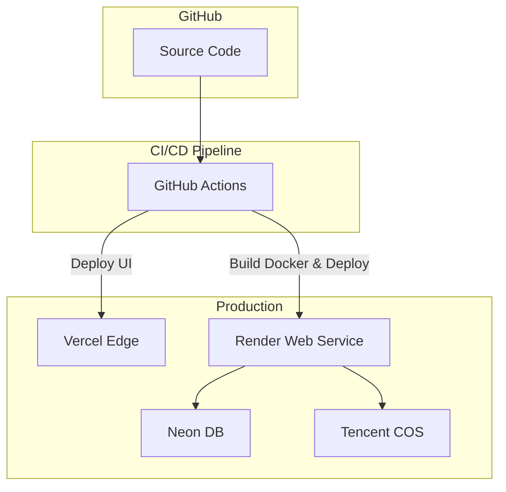

# Deployment Diagram & Strategy

## 1. Deployment Diagram

## 2. Deployment Steps (Render/Docker)
The Backend is containerized.
1. Code pushed to `main` branch.
2. GitHub Actions trigger testing and linting.
3. If passed, Render hooks pull the code and build the `Dockerfile`.
4. Express app connects to Neon and Tencent COS.

## 3. Frontend Deployment (Vercel)
1. GitHub Actions push directly or Vercel GitHub App triggers automatically on `main` push.
2. `npm run build` is executed.
3. Output directory (`dist`) is deployed to the edge.

## 4. Reverse Proxy / Web Server
- For Docker in Render, the container exposes port 8080. Render's internal Nginx handles HTTPS termination and load balancing.
- For local production simulation, a custom `nginx.conf` will be provided for `docker-compose`.

## 5. Migration Strategy
- Neon database migrations run automatically during the backend container startup or via an explicit CI step using standard PG clients.
