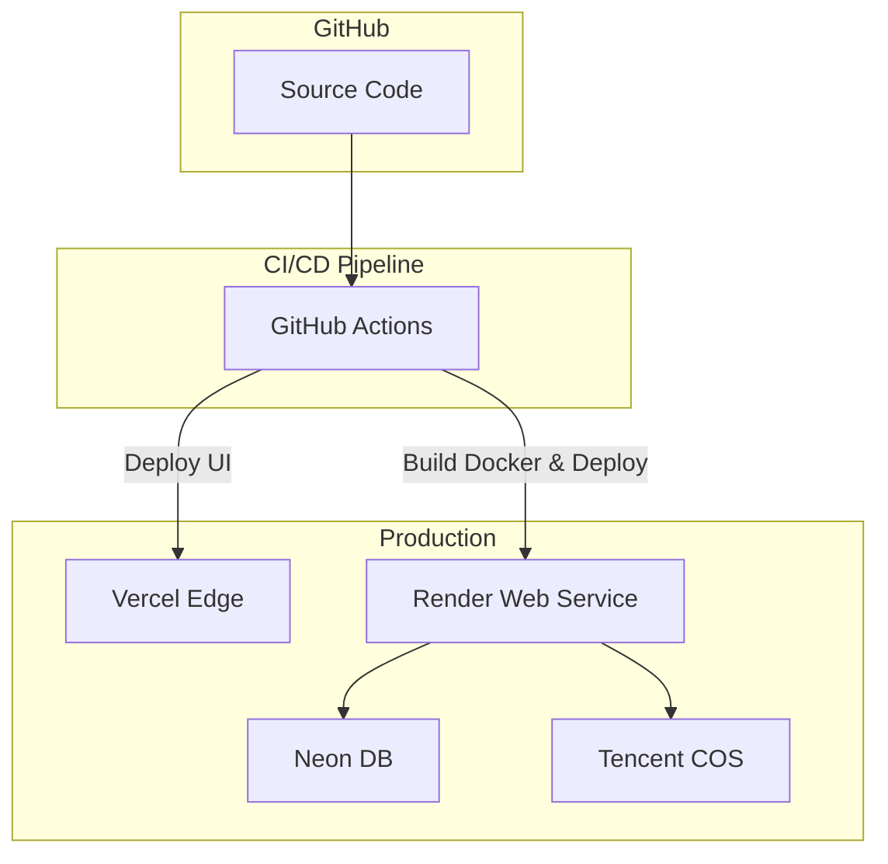
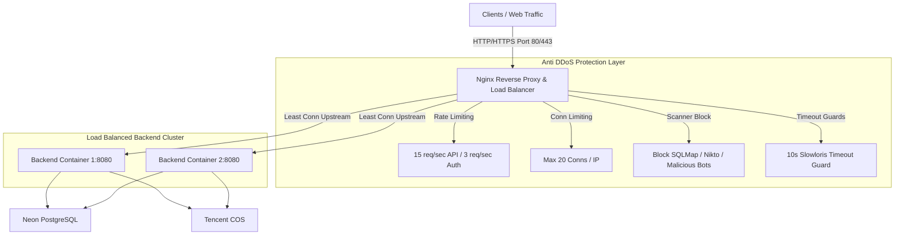

# Deployment Diagram & Strategy

## 1. Deployment Diagram



## 2. Deployment Steps (Render/Docker)
The Backend is containerized.
1. Code pushed to `main` branch.
2. GitHub Actions trigger testing and linting.
3. If passed, Render hooks pull the code and build the `Dockerfile`.
4. Express app connects to Neon and Tencent COS.

## 3. Frontend Deployment (Vercel)
1. GitHub Actions push directly or Vercel GitHub App triggers automatically on `main` push.
2. `npm run build` is executed.
3. Output directory (`dist`) is deployed to the edge.

## 4. Reverse Proxy, Load Balancing & Anti-DDoS Architecture

For production and local container deployment, Nginx serves as the primary ingress Gateway:



### 4.1 Nginx Security Features ("Anti-Server Crash / Anti-Jebol")
- **Rate Limiting (`limit_req_zone`)**:
  - `/v1/`: 15 requests/sec with a burst of 30.
  - `/v1/auth/`: 3 requests/sec to prevent brute-force attacks.
- **Connection Limiting (`limit_conn_zone`)**:
  - Max 20 concurrent connections per IP address to defend against Slowloris and TCP starvation.
- **Payload & Memory Protection**:
  - `client_max_body_size 100M` caps upload size to protect server memory.
  - Custom JSON 429 (`Too Many Requests`) and 503 (`Service Unavailable`) responses.
- **Malicious Scanner Blocking**:
  - Rejects user agents matching `sqlmap`, `nikto`, `dirbuster`, `nmap`, etc.

### 4.2 Local & Server Deployment (`docker-compose`)
To launch the load-balanced stack locally or on a production VM:
```bash
docker-compose up -d --build
```
This starts `ceguyyy_nginx_lb` on port `80`, load balancing requests across `ceguyyy_backend1` and `ceguyyy_backend2`.

## 5. Migration Strategy
- Neon database migrations run automatically during the backend container startup or via an explicit CI step using standard PG clients.

## 6. Upstash Context7 & Containerized Dependency Lock

### 6.1 Upstash Context7 Integration
[Upstash Context7](https://github.com/upstash/context7) is configured via [.context7.json](file:///c:/Users/CGuna/.gemini/antigravity-ide/scratch/CeguyyyDrive/.context7.json) to provide real-time, version-accurate documentation for project dependencies (Express 5, React 19, MUI 9, Tencent COS SDK, PostgreSQL `pg`, Zod).

To query real-time documentation or trigger Context7 MCP setup:
```bash
npm run ctx7
npm run ctx7:setup
```

### 6.2 Full Docker Dependency Isolation
All application dependencies are fully containerized using multi-stage Docker builds (`npm ci`) driven by exact `package-lock.json` lockfiles:
- **Zero Host Drift**: Prevents outdated or mismatched global node module versions on host machines.
- **Dependency Audit**: Run containerized vulnerability and deprecation checks:
  ```bash
  npm run docker:audit
  npm run docker:outdated
  ```
