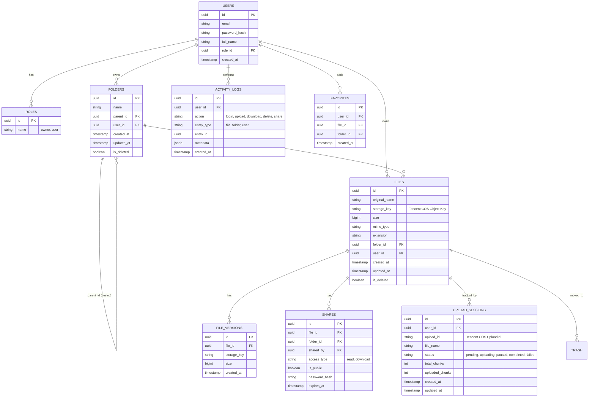

# Database ERD

```mermaid
erDiagram
    USERS ||--o{ ROLES : has
    USERS ||--o{ FOLDERS : owns
    USERS ||--o{ FILES : owns
    USERS ||--o{ ACTIVITY_LOGS : performs
    USERS ||--o{ FAVORITES : adds
    
    FOLDERS ||--o{ FOLDERS : "parent_id (nested)"
    FOLDERS ||--o{ FILES : contains
    
    FILES ||--o{ FILE_VERSIONS : has
    FILES ||--o{ SHARES : has
    FILES ||--o{ UPLOAD_SESSIONS : tracked_by
    FILES ||--o{ TRASH : moved_to
    
    USERS {
        uuid id PK
        string email
        string password_hash
        string full_name
        uuid role_id FK
        timestamp created_at
    }
    
    ROLES {
        uuid id PK
        string name "owner, user"
    }

    FOLDERS {
        uuid id PK
        string name
        uuid parent_id FK
        uuid user_id FK
        timestamp created_at
        timestamp updated_at
        boolean is_deleted
    }

    FILES {
        uuid id PK
        string original_name
        string storage_key "Tencent COS Object Key"
        bigint size
        string mime_type
        string extension
        uuid folder_id FK
        uuid user_id FK
        timestamp created_at
        timestamp updated_at
        boolean is_deleted
    }

    FILE_VERSIONS {
        uuid id PK
        uuid file_id FK
        string storage_key
        bigint size
        timestamp created_at
    }

    SHARES {
        uuid id PK
        uuid file_id FK
        uuid folder_id FK
        uuid shared_by FK
        string access_type "read, download"
        boolean is_public
        string password_hash
        timestamp expires_at
    }

    FAVORITES {
        uuid id PK
        uuid user_id FK
        uuid file_id FK
        uuid folder_id FK
        timestamp created_at
    }

    UPLOAD_SESSIONS {
        uuid id PK
        uuid user_id FK
        string upload_id "Tencent COS UploadId"
        string file_name
        string status "pending, uploading, paused, completed, failed"
        int total_chunks
        int uploaded_chunks
        timestamp created_at
        timestamp updated_at
    }

    ACTIVITY_LOGS {
        uuid id PK
        uuid user_id FK
        string action "login, upload, download, delete, share"
        string entity_type "file, folder, user"
        uuid entity_id
        jsonb metadata
        timestamp created_at
    }
```
